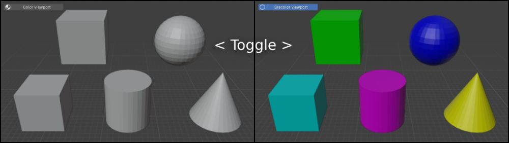

# Messhes
Messhes is a Blender addon with multiple functionalities.

It uses Python and Blender-Python API.

## Available tools

### Toggle viewport colors:
Change materials diffuse color to make it easier to distinguish between materials in the viewport.

